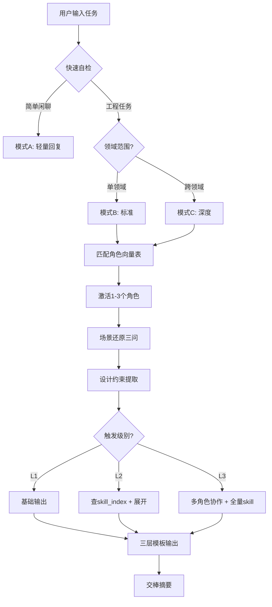

# DeepSeek Codex Boost

> 让 DeepSeek 在 Codex CLI 中接近 Claude 80% 的工程能力

## 这是什么？

这是一套为 **DeepSeek 模型 + Codex CLI** 量身定做的提示词工程增强包。通过多层架构设计，补足 DeepSeek 在以下方面的短板：

- **全局思维**：意图识别 → 角色激活 → 场景还原 → 约束提取，四步自检链
- **任务聚焦**：角色向量表驱动本能关注点，防止输出发散
- **输出质量**：三层递进模板（L1 总览 → L2 详情 → L3 决策说明），强制完成不截断
- **项目记忆**：agent_memory 模板（context / progress / bugs），跨会话保持上下文
- **多代理协作**：Plan → Design → Build → QA → Ship 五节点流水线
- **安全约束**：freeze / guard / careful 三层防御

## 目录结构

```
deepseek-codex-boost/
├── AGENTS.md                          # 用户级配置（核心入口，含意图识别/角色激活/输出分层规则）
├── deepseek-prompt/
│   ├── system_prompt.md               # DeepSeek 专用 system prompt（含角色向量表压缩版）
│   ├── role_vectors.json              # 10 个角色向量结构化完整数据（维护用）
│   └── skills/
│       └── role_updater.md            # 角色扩展子技能（新增角色标准流程）
├── skill_index.md                     # 78 个 skill 关键词索引匹配表
├── templates/
│   └── agent_memory/
│       ├── context.md                 # 项目上下文模板
│       ├── progress.md                # 进度跟踪模板
│       └── bugs.md                    # 问题/风险记录模板
├── skills/                            # 18 个 DeepSeek 专用 skill
├── install.sh                         # 一键安装脚本（自动备份）
└── README.md
```

## 核心引擎详解

系统的核心引擎由三个文件构成：`system_prompt.md`（运行时 prompt）、`role_vectors.json`（角色数据）、`role_updater.md`（角色扩展工具）。它们协同工作，驱动整个意图识别 → 角色激活 → 多角色协作的 pipeline。

---

### system_prompt.md — DeepSeek 专用 System Prompt

这是注入到 DeepSeek 模型层的运行时指令，包含完整的行为约束链：

**一、意图识别（3 步快速自检，不输出中间过程）**
- 对话类型：简单闲聊 / 工程任务？
- 领域范围：单领域 / 跨领域？
- 用户状态：随口问 / 正式需求？

**二、三种执行模式**

| 模式 | 触发条件 | 行为 |
|------|----------|------|
| **模式A · 轻量** | 单领域 + 随口问 | 简短回复，不激活角色，跳过场景还原 |
| **模式B · 标准** | 单领域 + 正式需求 | 激活角色 + 场景还原 + 三层输出 |
| **模式C · 深度** | 跨领域 + 正式需求 | 多角色协作 + 场景还原 + 完整报告 + 关键决策点暂停确认 |

**三、场景还原（必须执行的三问，不完成不得进入输出）**

按输出模板类型回答：
- **technical 类**：这个系统里有哪些角色？数据怎么流动？哪里最容易出问题？
- **analysis 类**：这个指标服务于谁的决策？会被怎么误读？数据断在哪里？
- **strategy 类**：解决谁的什么问题？用户在哪一步会放弃？三年后这个判断还成立吗？

**四、设计约束提取（不完成不得进入 Layer1）**

格式：`因为[业务事实]，所以[设计约束]`，每条必须能对应到后续至少一张表或一个设计决策。

**五、渐进加载规则**

| 级别 | 触发条件 | 执行内容 |
|------|---------|----------|
| L1 基础 | 所有模式B/C | 激活角色 + 场景还原 + 约束提取 |
| L2 展开 | 含"细化/完整/详细/方案" 或涉及2+子模块 | L1 + 查 `skill_index.md` + 标注建议 skill |
| L3 深度 | 命中3+角色标签 或明确说"完整方案/全面分析" | L2 + 多角色协作 + 全量 skill 建议 |

**六、角色向量表（压缩版，10 个角色）**

包含 trigger_tags / 本能关注点 / 输出模板 / L2 skill / L3 skill，直接内嵌在 prompt 中以减少查表延迟。

**七、三层输出模板**

- `technical`：L1 总览（ERD/架构图）→ L2 逐模块详情 → L3 决策说明（选了什么·放弃了什么·为什么）
- `analysis`：L1 结论先行 → L2 数据支撑 → L3 延伸建议
- `strategy`：L1 方案概览 → L2 详细展开 → L3 风险与取舍

**八、交棒格式**：三层输出完成后固定输出交棒摘要，包含核心结论、关键约束、建议延续角色、建议调用 skill。

---

### role_vectors.json — 角色向量完整数据

`system_prompt.md` 中的角色表是压缩版（只有一行），`role_vectors.json` 是结构化完整版。每个角色对象包含 11 个字段：

```json
{
  "id": "system_architect",
  "name": "系统架构师",
  "trigger_tags": ["系统设计", "架构", "模块划分", "服务拆分", "技术选型"],
  "instincts": ["业务边界", "可扩展性", "数据一致性", "接口契约"],
  "output_template": "technical",
  "l2_skills": ["plan-agent", "review"],
  "l3_skills": ["investigate", "plan-eng-review"],
  "layer3_focus": [
    "为什么这样划分服务边界",
    "哪些地方做了反范式设计及原因",
    "接口契约的关键取舍"
  ]
}
```

**字段说明：**

| 字段 | 类型 | 说明 |
|------|------|------|
| `id` | string | 唯一标识符，snake_case |
| `name` | string | 中文角色名称 |
| `trigger_tags` | string[] | 任务关键词匹配用，命中得 1 分 |
| `instincts` | string[] | 本能关注点，约束注意力范围（2-4 个） |
| `output_template` | enum | 输出模板类型：`technical` / `analysis` / `strategy` |
| `l2_skills` | string[] | L2 展开时建议调用的 skill ID |
| `l3_skills` | string[] | L3 深度时补充调用的 skill ID |
| `layer3_focus` | string[] | Layer3 决策说明的必答问题（2-4 个） |

**10 个角色一览：**

| 角色 | 模板类型 | 本能关注点 | L2 展开 skill |
|------|----------|-----------|---------------|
| 系统架构师 | technical | 业务边界·可扩展性·数据一致性·接口契约 | plan-agent, review |
| 高级产品经理 | strategy | 用户体验·业务目标·边界条件·优先级 | brainstorming-plan, plan-ceo-review |
| 数据库工程师 | technical | 范式取舍·索引策略·枚举设计·命名规范 | plan-agent, review |
| 业务分析师 | technical | 业务语义·数据口径·报表可追溯·异常态 | plan-agent, learn |
| SaaS业务专家 | technical | 租户隔离·权限粒度·数据安全·功能开关 | plan-agent, cso |
| 数据分析师 | analysis | 指标定义·口径一致·异常识别·结论可追溯 | health, investigate |
| 前端工程师 | technical | 组件复用·状态管理·性能·交互反馈 | frontend-design-build, design-agent |
| 后端工程师 | technical | 幂等性·错误码·性能瓶颈·事务边界 | build-agent, review |
| 资深编辑 | strategy | 受众共鸣·信息层次·简洁·情绪节奏 | brainstorming-plan, documents |
| 战略顾问 | strategy | 第一性原理·假设显化·风险识别·优先级 | office-hours, brainstorming-plan |

**三种输出模板的三层结构**（定义在 `templates` 字段中）：

| 模板 | L1 | L2 | L3 |
|------|----|----|-----|
| technical | 总览（ERD/架构图） | 详情（逐模块展开） | 决策说明（取舍与原因） |
| analysis | 结论（先说结果） | 数据支撑（再说依据） | 延伸建议 |
| strategy | 方案概览（核心思路） | 详细展开 | 风险与取舍 |

**为什么分两个文件？**

- `system_prompt.md` 内嵌压缩版角色表 — 减少运行时 token 消耗，快速匹配
- `role_vectors.json` 完整版 — 供 `role_updater.md` 读写维护，新增角色时同步更新两个文件

---

### skills/role_updater.md — 角色扩展子技能

当用户说「新增一个角色」「加一个XXX角色」「现有角色不够用」时触发。标准流程：

**Step 1 · 一次性收集信息**
- 角色名称？主要处理哪类任务？（几个关键词）
- 最本能关注什么？（2-4 个点）
- 输出结构偏向：技术类 / 分析类 / 策略类？
- L2 展开时建议调用哪些 skill？（参考 `skill_index.md`）

**Step 2 · 生成角色对象** — 输出可直接追加到 `role_vectors.json` 的完整 JSON 对象

**Step 3 · 同步更新 system_prompt.md** — 生成向量表新增行，追加到表格末尾

**Step 4 · 确认** — 提示用户如需同时更新 `AGENTS.md` 附录需手动操作

---

## 核心设计：意图识别 → 角色激活 → 场景还原

### 完整 Pipeline 数据流



### 三层输出模板

```
Layer 1 · 总览（架构图/ERD/关系图）
    ↓
Layer 2 · 详情（逐模块展开，字段含类型、枚举值、设计说明）
    ↓
Layer 3 · 决策说明（选了什么·放弃了什么·为什么）
```

## Skill 索引

`skill_index.md` 包含 78 个 skill 的关键词匹配表，分为以下类别：

- **构建与开发**：build-agent / plan-agent / qa-agent / ship-agent / design-agent
- **审查与审计**：review / cso / design-review / devex-review / plan-ceo-review / plan-eng-review / plan-design-review
- **浏览器与搜索**：browse / browser / chrome / anysearch / agent-reach-ops / scrape / defuddle-build
- **设计与前端**：frontend-design-build / design-consultation / design-shotgun / design-html / ui-ux-pro-max-build
- **部署与发布**：ship / land-and-deploy / canary / setup-deploy
- **文档与知识**：document-release / learn / context-save / context-restore / make-pdf / markitdown-skill-build
- **测试**：qa / qa-only / playwright-best-practices-qa
- **规划与创意**：brainstorming-plan / office-hours / karpathy-guidelines-plan / retro / plan-tune / multi-agent
- **其他**：Obsidian 生态 / 图像 / 文档查询 / 技能管理

L2/L3 触发时，系统通过关键词匹配查此表决定调用哪些 skill。

## Agent Memory 模板

每个项目启动时自动从 `templates/agent_memory/` 创建三文件记录：

| 文件 | 用途 | 何时更新 |
|------|------|----------|
| `context.md` | 项目概述 / 技术栈 / 依赖服务 / 约定 / 已知坑位 | 项目初始化、技术栈变更 |
| `progress.md` | 当前阶段 / 进行中 / 待完成 / 已交付 / 阻塞项 | 阶段完成、方向变化、会话结束 |
| `bugs.md` | 开放问题（P0-P2）/ 已解决 / 风险记录 | 发现 bug、修复后 |

过长时自动压缩摘要归档至 `archive/` 子目录。

## 安装

```bash
git clone https://github.com/kajalghosh5334-jpg/deepseek-codex-boost.git
cd deepseek-codex-boost
chmod +x install.sh
./install.sh
```

安装脚本会将文件部署到 `~/.codex/` 对应位置，**自动备份**已有文件到 `~/.codex/backup_YYYYMMDD_HHMMSS/`。

## 前置条件

- 已安装 [Codex CLI](https://github.com/openai/codex)
- 配置 DeepSeek 为模型提供方（`config.toml` 中设置 `model = "deepseek-v4-pro"`）
- DeepSeek 通过兼容 OpenAI API 的代理运行

## 效果对比

| 维度 | 原生 DeepSeek | + Boost |
|------|:---:|:---:|
| 全局架构思维 | ⭐⭐ | ⭐⭐⭐⭐ |
| 任务聚焦度 | ⭐⭐ | ⭐⭐⭐⭐ |
| 输出完整性（不提前截断） | ⭐⭐ | ⭐⭐⭐⭐⭐ |
| 工程决策可追溯 | ⭐ | ⭐⭐⭐⭐ |
| 跨会话上下文保持 | ⭐ | ⭐⭐⭐⭐ |
| 多 Agent 协作 | ⭐ | ⭐⭐⭐⭐ |

## 原理

DeepSeek 模型的推理能力强，但在 Codex CLI 环境中的**行为遵循度**不如 Claude。这套 prompt 的核心思路是：

1. **结构化自检链**：通过 AGENTS.md 强制模型在输出前完成 5 步自检（意图识别 → 模式选择 → 角色激活 → 场景还原 → 约束提取）
2. **角色驱动输出**：用角色向量的"本能关注点"约束注意力范围，每个角色只有 2-4 个核心关注维度
3. **分层渐进**：L1/L2/L3 机制防止跳步和截断，L3 强制给出决策说明
4. **数据分离**：system_prompt.md（运行时压缩版）+ role_vectors.json（维护完整版）+ role_updater.md（扩展工具），三者协同
5. **项目记忆**：agent_memory 模板保持跨会话上下文，防止每次对话都从零开始

适合 DeepSeek v4-pro 及类似高推理能力但遵循度偏弱的模型。

## License

MIT
